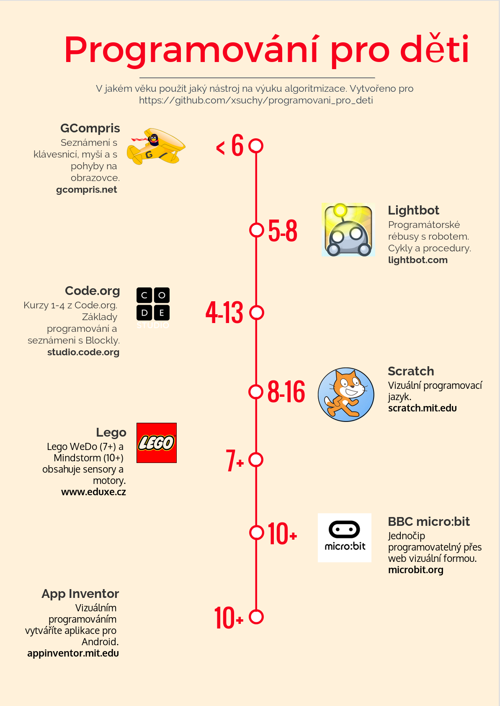

## Doporučení pro starší/mladší děti

Nabídka kurzů se bude rozšiřovat, ale vždy tu budou děti mladší,
či starší. Velmi pěkný souhrn možných aktivit je u Mirka Suchého
na [jeho githubu](https://github.com/xsuchy/programovani_pro_deti).

A velmi pěkný souhrn základních možností z jeho stránek si dovolím
sdílet zde:

