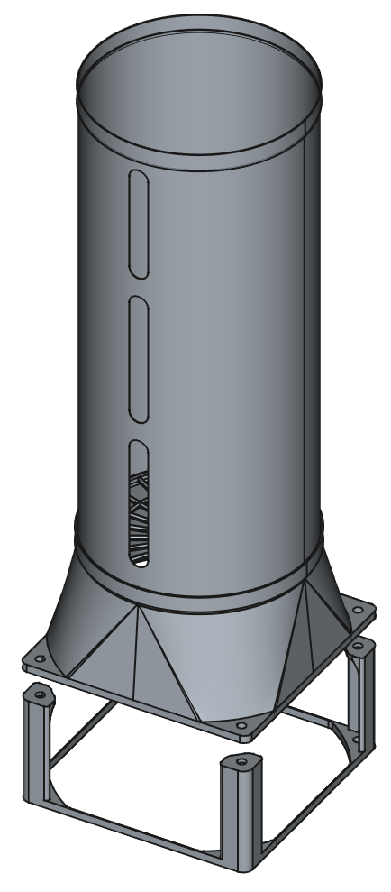
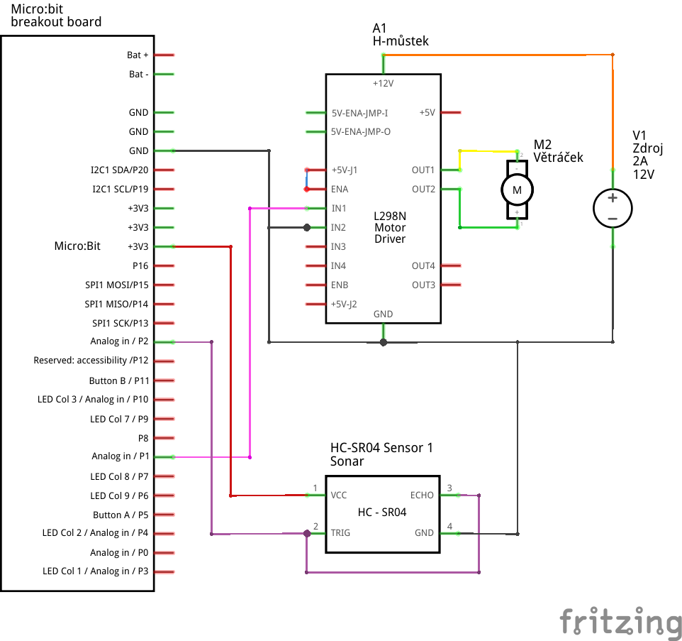
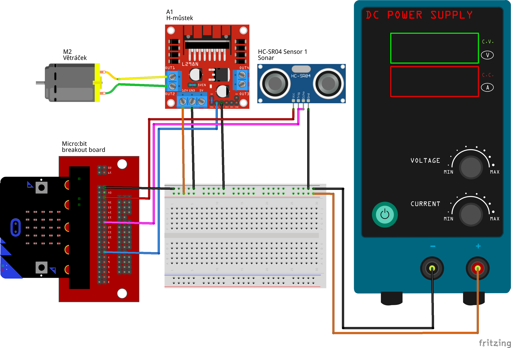
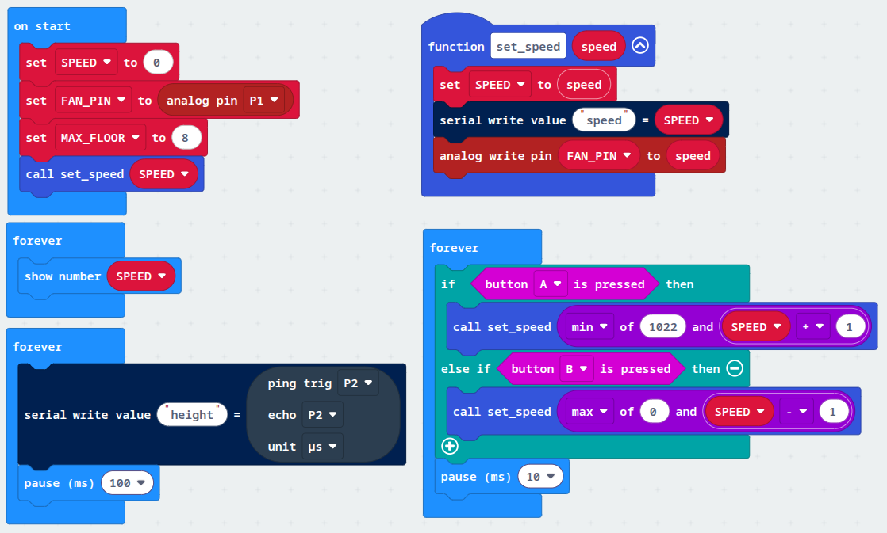
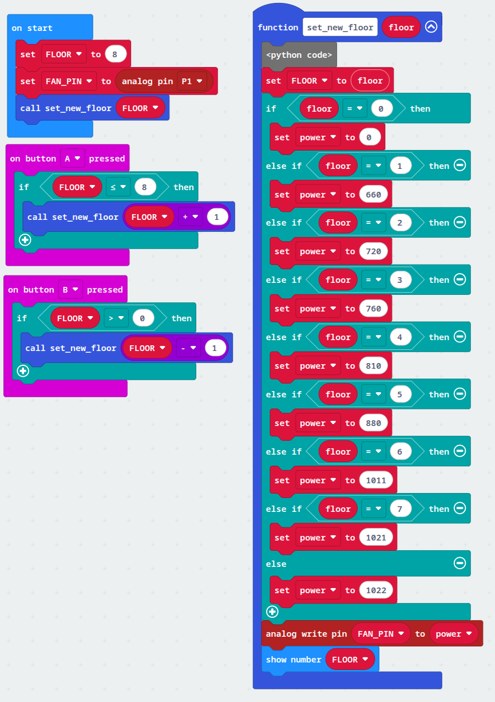
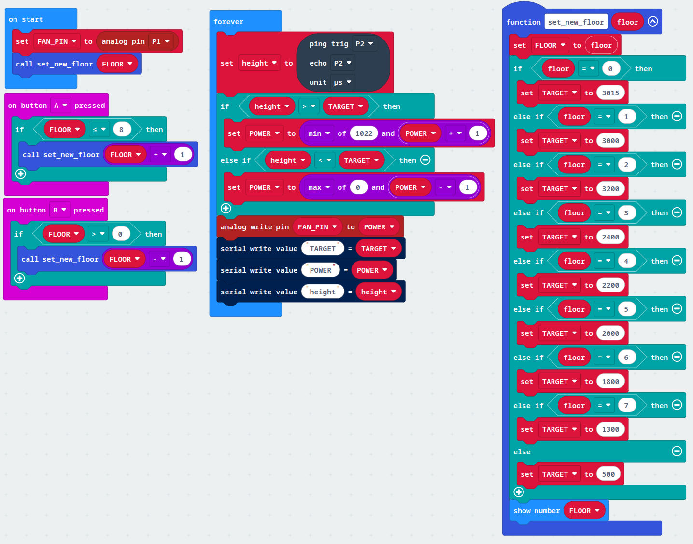
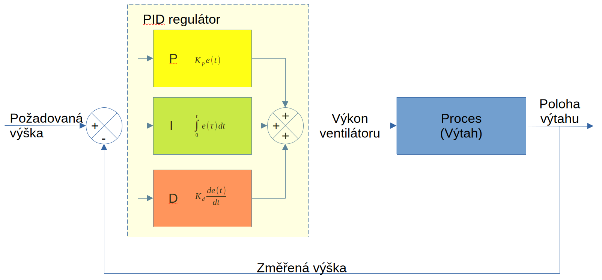
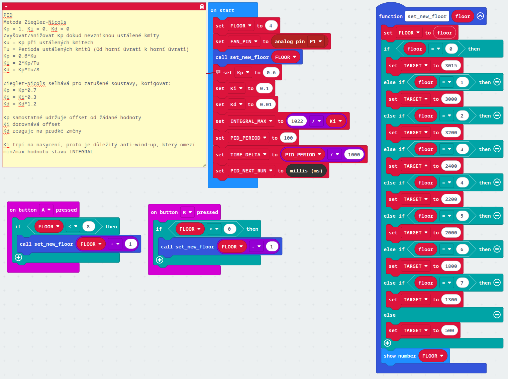
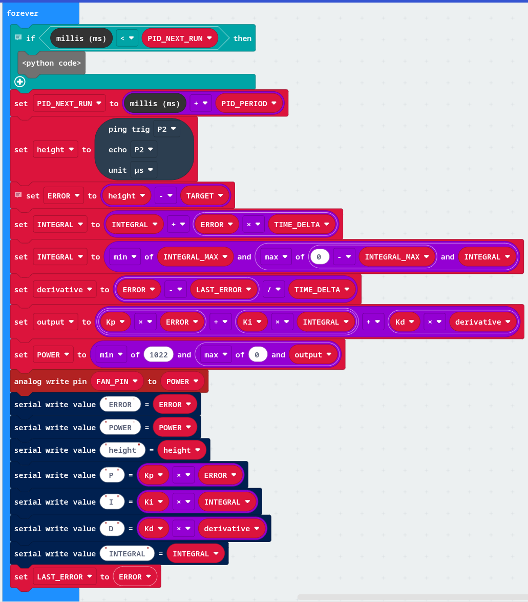

Vzduchový výtah
===============

**Cílem projektu je vytvořit výtah poháněný větráčkem z PC.**

Pomůcky
-------



Dílky k vytištění:

* [spodek](vytah/00_spodek.3mf)
* [přechod větrák->střed](vytah/10_prechod.3mf)
* [mřížka](vytah/20_mrizka.3mf)
* [potrubí](vytah/30_stred.3mf)

Celá sestava ve formátu FreeCAD [zde](vytah/vytah.FCStd)

Další potřebné pomůcky:

* 12cm PC ventilátor
* L298N DC Motor Driver (či dostatečně dimenzovaný tranzistor)
* Kalíšek/Papír/Míček
* Sonar module (HC-SR04)
* Micro:bit + breakout module

Zapojení
--------

Na vyzkoušení stačí připojit větráček na regulovatelný zdroj a otestovat základní funkci.
Cílové zapojení včetně ovládání otáček pomocí Micro:bitu a měřením vzdálenosti pomocí
sonaru ve formátu Fritzing [zde](vytah/zapojeni.fzz), či jako obrázky níže:




Detekce pater
-------------

Jednoduchý prográmek pro manuální ovládání větráčku, který se hodí pro zjištění
požadovaného výkonu pro určité patro, později i k měření hodnot ze senzoru vzdálenosti.
Výška se zobrazí na displayi, případně je k dispozici i na sériové konzoli. Tu
zobrazíme kliknutím na "Show data" pod Micro:bitem v editoru makecode.

Pomocí tlačítka "A" a "B" můžeme měnit výkon ventilátoru a přiřadit tak požadované
hodnoty k jednotlivým patrům.

Všimněte si, že tlačítka "A" a "B" nejsou ovládány pomocí "on button press" ale jsou
kontrolovány v nekonečné smyčce. Napadá vás proč?



Ovládání
--------

Nyní, když už známe přibližné hodnoty výkonu větráčku můžeme naprogramovat nejjednodušší
verzi bez zpětné vazby. Tlačítky "A" a "B" zvolíme patro a pokud jsme nastavili správné
hodnoty, měl by se výtah dostat do požadovaného patra.

* Co se stane, pokud změním kalíšek za jiný, nebo když "přidám" náklad?



Řízení
------

Zpětnovazební řízení využívá zpětné vazby od senzoru vzdálenosti a snaží se neustále
korigovat výkon větráčku tak, aby změřená výška odpovídala.

* Co se stane, když budeme přičítat větší čísla?
* Nešlo by to nějak vylepšit? Jak?



Řízení regulátorem PID
----------------------



V praxi se často používají regulátory PID, které kombinují tři způsoby řízení:

* P (proporcionální) – čím větší je odchylka, tím silněji zasahuji
* I (integrační) – chybu si postupně „pamatuji“ a přičítám ji, aby se úplně odstranila
* D (derivační) – sleduji, jak rychle se chyba mění, a snažím se zabránit prudkým změnám

Případně lze říci:

* P – když jsem daleko od cíle, víc přidám
* I – když se dlouho netrefuji, postupně to doháním
* D – když se blížím moc rychle, začnu brzdit




```python
def set_new_floor(floor: number):
    global FLOOR, TARGET
    FLOOR = floor
    if floor == 0:
        TARGET = 3015
    elif floor == 1:
        TARGET = 3000
    elif floor == 2:
        TARGET = 3200
    elif floor == 3:
        TARGET = 2400
    elif floor == 4:
        TARGET = 2200
    elif floor == 5:
        TARGET = 2000
    elif floor == 6:
        TARGET = 1800
    elif floor == 7:
        TARGET = 1300
    else:
        TARGET = 500
    basic.show_number(FLOOR)

def on_button_pressed_a():
    if FLOOR <= 8:
        set_new_floor(FLOOR + 1)
input.on_button_pressed(Button.A, on_button_pressed_a)

def on_button_pressed_b():
    if FLOOR > 0:
        set_new_floor(FLOOR - 1)
input.on_button_pressed(Button.B, on_button_pressed_b)

################
# Hodnoty výtahu
################
TARGET = 0              # Požadovaná výška změřená senzorem
FLOOR = 0               # Zvolené patro výtahu
FAN_PIN = AnalogPin.P1  # Na jakém pinu je připojený větráček

###############
# PID regulátor
###############
# Metoda Ziegler-Nicols
# Kp = 1, Ki = 0, Kd = 0
# Zvyšovat/Snižovat Kp dokud nevzniknou ustálené kmity
# Ku = Kp při ustálených kmitech
# Tu = Perioda ustálených kmitů (Od horní úvrati k horní úvrati)
# Kp = 0.6*Ku
# Ki = 2*Kp/Tu
# Kd = Kp*Tu/8
#
# Ziegler-Nicols selhává pro zarušené soustavy, korigovat:
# Kp = Kp*0.7
# Ki = Ki*0.3
# Kd = Kd*1.2
#
# Kp - jak silně reagujeme na aktuální chybu
# Ki - jak moc se učíme z minulých chyb
# Kd - jak moc brzdíme rychlé změny
#
# Ki trpí na nasycení, proto je důležitý anti-wind-up, který omezí
# min/max hodnotu stavu INTEGRAL
Kp = 0.6        # Výkon složky P
Ki = 0.1        # Výkon složky I
Kd = 0.01       # Výkon složky D
LAST_ERROR = 0  # Předchozí chyba
INTEGRAL = 0    # Paměť integrační složky
INTEGRAL_MAX = 1022 / Ki         # Omezení integrační složky tak, aby nevystoupala do nekonečných výšin (anti-wind-up)
PID_PERIOD = 100                 # Jak často bude PID regulátor reagovat na vstup
TIME_DELTA = PID_PERIOD / 1000   # Normalizace změny času
PID_NEXT_RUN = control.millis()  # Kdy má příště PID regulátor běžet

set_new_floor(FLOOR)    # Než začnu, nastavím hodnoty podle zvoleného poschodí FLOOR

def on_forever():
    # Globální proměnné které budeme přepisovat
    global PID_NEXT_RUN, INTEGRAL, LAST_ERROR

    # Počkej na další periodu
    if control.millis() < PID_NEXT_RUN:
        return

    # Nejprve vypočteme kdy znovu reagovat na změnu
    PID_NEXT_RUN = control.millis() + PID_PERIOD

    # Změříme výšku
    height = sonar.ping(DigitalPin.P2, DigitalPin.P2, PingUnit.MICRO_SECONDS)

    # Přepočítáme reakci PID regulátoru
    # Chyba = kde jsme teď - kde chceme být
    # Výšku měříme shora, proto má chyba opačné znaménko
    error = height - TARGET     # error (chyba) = kde jsme teď - kde chceme být; výšku měříme shora, proto má chyba opačné znaménko (height - TARGET vs. TARGET - height)
    INTEGRAL = INTEGRAL + error * TIME_DELTA    # Přičteme současnou chybu do paměti
    INTEGRAL = min(INTEGRAL_MAX, max(0 - INTEGRAL_MAX, INTEGRAL))   # Omezíme na rozumný rozsah (anti-wind-up)
    derivative = (error - LAST_ERROR) / TIME_DELTA  # Jak velká byla změna chyby od posledně normalizováno v čase
    output = Kp * error + Ki * INTEGRAL + Kd * derivative   # Výstup je kombinací P+I+D složek
    # Omezíme výstup na hodnoty přijatelné pro náš větráček
    # Maximální hodnota je teoreticky 1023, ale rozdíl mezi 1022 a 1023 je v našem případě tak
    # velký, že omezíme maximální výkon na stále-ještě-analogovou hodnotu 1022.
    power = min(1022, max(0, output))
    pins.analog_write_pin(FAN_PIN, power)   # Změň hodnotu výstupu (využívá PWM - pulzní modulaci)

    # Debug výstup hodnot na sériovou konzoli
    serial.write_value("error", error)
    serial.write_value("POWER", power)
    serial.write_value("height", height)
    serial.write_value("P", Kp * error)
    serial.write_value("I", Ki * INTEGRAL)
    serial.write_value("D", Kd * derivative)
    serial.write_value("INTEGRAL", INTEGRAL)

    # Jako poslední si uložíme odchylku jako předchozí známou hodnotu
    LAST_ERROR = error

basic.forever(on_forever)
```
