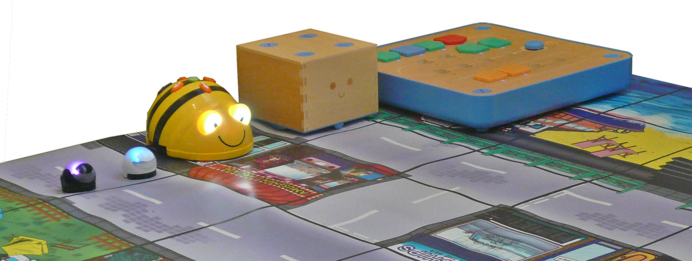

# 2019

Od října bude na **ZŠ Nuselská** probíhat kurz **Programování
přípravka** určený dětem první[1](#footnote1), popřípadě
druhé třídy. Cílem tohoto kurzu je rozvíjení přirozené touhy dětí
po poznávání okolního světa s důrazem na techniku.

Kurz bude probíhat 1x týdně, vždy ve čtvrtek 12:30-13:30, popřípadě
druhý kurz 13:45-14:45.

V kurzu budeme využívat robůtky [Cubetto](https://www.primotoys.com),
[Beebot](https://www.bee-bot.us/) i [Ozobot](https://ozobot.com/).
Zároveň se budeme věnovat i práci na PC pomocí open source aplikace
[GCompris](https://gcompris.net) a začneme kurzy z platformy
[code.org](https://www.code.org). Pro zpestření budou kurzy provázeny
tvůrčími aktivitami s papírem, kostkami a jinými rekvizitami.

Cílem kurzu není vzdělat hotového programátora, ale rozvíjet logické
myšlení, algoritmizaci a jiné vlastnosti, které se dětem budou hodit
při studiu jakéhokoliv oboru.

Kurz bude organizován [Lukášem Doktorem](../lectors/ldoktor.md)

## 1. hodina

* Seznámení s lektorem a ostatními spolužáky
* Stránky www.code.org:
    * Nastavení účtu
    * Přehled ovládání
    * Posun "flurbse" po mapě
    * Skládání puzzlíků
* Beebot
    * Seznámení s Beeboty (včelkami)
    * Krokování vestoje bez robotů (pouze vpřed+vzad)
    * Programování Beebotů (pouze vpřed+vzad)
* Bonus - Malování tras pro Ozobota

* * * * * * * * *

<a name="footnote1">1</a>: Dle psychologa [Jeana Piageta](https://cs.wikipedia.org/wiki/Jean\_Piaget)
nelze děti mladší 6-7 let učit systematické vědy, neboť se nacházejí
ve stádiu `názorového (prelogického) myšlení`, které ještě plně
nerespektuje logiku. Ukázka experimentu je ke shlédnutí například
[zde](https://www.youtube.com/watch?v=tQLpysTbFso) (doporučuji vyzkoušet),
výuka mateřského jazyku začíná také daleko dříve, než je děťátko schopné
jej pochopit a přirozeně se vytváří návyky a spoje, jež jednou vedou v
schopnost mluvit a myslet v daném jazyce. Bilingvální výchova pak vede
ke schopnosti mluvit a myslet ve více jazycích. Proto věřím, že správným
přístupem lze začít daleko dříve a sám využívám logické hry, roboty i
počítač ke hře a vlastně i výuce svých dětí takřka od narození.

