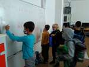
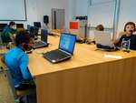
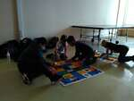
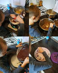
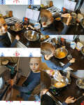

# 2020/2021

Kurz **Programování na Nuselské** bude probíhat od října 2020
a navazuje na kurz **začátečníci**. Je určen pro děti druhých
a třetích tříd s tím, že děti druhých tříd musí mít absolvovaný
kurz začátečníci, šikovní jedinci z řad třetích tříd mohou
přijít i bez předchozího vzdělání.

Cílem tohoto kurzu je pokračování v rozvoji systematického
myšlení, hlubší poznávání světa informační techniky
a osvojení si základů elektrotechniky.

Kurz bude probíhat 1x týdně, každý čtvrtek od 15:05 v počítačové
učebně.

V kurzu budeme využívat robůtky [Cubetto](https://www.primotoys.com),
[Beebot](https://www.bee-bot.us/) i [Ozobot](https://ozobot.com/).
Později si představíme platformu [Micro:bit](https://microbit.org)
a s ní zabředneme trochu blíže k elektrotechnice. Kromě těchto
se budeme věnovat i práci na PC, kde se budeme učit programovat
pomocí vybraných kurzů na [code.org](https://www.code.org),
prostředí [scratch](https://scratch.mit.edu/) a dalších.
To vše proložíme tvůrčími aktivitami s papírem, kostkami a jinými
rekvizitami.

Cílem kurzu není vzdělat hotového programátora, ale rozvíjet logické
myšlení, algoritmizaci a jiné vlastnosti, které se dětem budou hodit
při studiu jakéhokoliv oboru.

Kurz bude organizován a veden [Lukášem Doktorem](../lectors/ldoktor.md)

## 1. hodina

* Seznámení s lektorem a ostatními spolužáky
* Přihlášení k počítačům - drobné technické potíže
* Stránky www.code.org
  * Nastavení účtu
  * Programování na papíru (tabuli)
* Demonstrace pomůcek
  * Beebot
  * Ozobot
  * Micro:bit + příslušenství

## 2. hodina

* Beeboti
  * seznámení
  * základy pohybu po mapě
  * opakovaný pohyb
* www.code.org
  * 3 - Angry birds bludiště

## 3. hodina

* Videokonference [návod na připojení](../../media/jitsi-navod.mp4)
  * Dokončení lekce 3 - Bludiště
  * Uvedení do lekce 4 - Umělec
    * Vždy čtěte zadání
    * Nezapomeňte využívat nápovědy (žárovka nalevo od textu zadání)
    * Pixely jsou čtverečky, ze kterých se skládá obraz
    * Otáčíme se o úhel udávaný ve stupních, 90° je pravý úhel a odpovídá našemu "otočení se" v předchozí lekci. Bližší info <a href="https://www.slideserve.com/trang/m-en-hl">zde</a>
  * V rámci možností mohou děti samostatně pokračovat v umělcovi
    * Když něco nepůjde, doporučuji pauzu a zkusit to druhý den (či později)
    * Když se i tak nebude dařit, je možné přeskočit úroveň
    * Rodiče by neměli pomáhat
  * Příště vyjasníme případné nesrovnalosti, dokončíme umělce a začneme cykly

## 4. hodina

* Videokonference [návod na připojení](../../media/jitsi-navod.mp4)
  * Dokončení lekce 4 - Umělec
    * Opakuji, nezapomeňte číst zadání a případně použít nápovědu (žárovka nalevo od textu zadání)
  * Lehký úvod do cyklů/opakování
  * Domácí úkol:
    * Všímejte si, kde se v okolním světě vyskytuje či dá využít opakování (např. dlaždičky, plot, hudba, ...)
    * Pročtěte a porovnejte jednotlivá zadání z [[pdf](pokrocili-1-04-peceni.pdf), [odt](pokrocili-1-04-peceni.odt)]
    * Opravite "Pseudo-kód pro počítač" v receptu [[pdf](pokrocili-1-04-peceni.pdf), [odt](pokrocili-1-04-peceni.odt)] za pomocí opakování, viz. ukázka v prvních dvou krocích.
    * Volitelně se můžete pokusit dort upéci. Který návod Vám vyhovoval nejvíce?

## 5. hodina

* Videokonference [návod na připojení](../../media/jitsi-navod.mp4)
  * Řešení k domácímu úkolu [[pdf](pokrocili-1-05-peceni-reseni.pdf), [odt](pokrocili-1-05-peceni-reseni.odt)]
    * Doporučuji projít s dětmi, je důležité uvědomit si rozdíl mezi opakováním jedné instrukce a opakování sledu několika instrukcí
  * www.code.org - lekce 6 - Bludiště cykly
    * Jednoduchá opakování, opakování sledu instrukcí/bločků a kombinace
    * Doporučuji projít si všechny úrovně z této lekce a pokusit se dotáhnout je do kompletního řešení. To poznáme tmavě zelenou barvou oproti světle zelené která funguje, ale není optimální.
  * Domácí úkol:
    * Procvičovat cykly/opakování ať už v reálném světě (vaření, kutění, skládání z lega, ...), tak v lekci 6 na code.org. Začátky jsou těžké, ale postupně by mělo vše začít do sebe zapadat.

