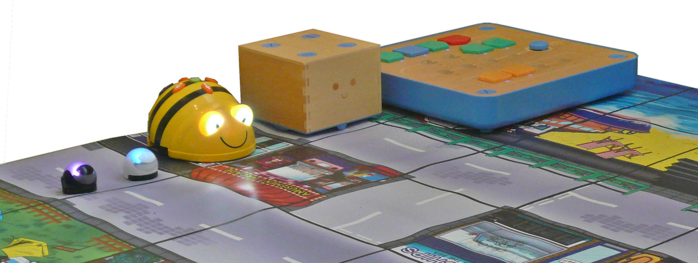

# Programování pro děti

 

tato stránka obsahuje základní informace o kurzu **Programování pro
děti** pořádaném na **ZŠ Nuselská** a zároveň bude obsahovat
materiály použité v jednotlivých lekcích aby mohly sloužit studentům
jako připomínka, či jiným lektorům jako zdroj informací.

## Aktuality:

**Příští rok (2023-2024) opět plánuji cca 3 skupiny kurzu programování
na Nuselské. Termíny lekcí budou upřesněny koncem srpna/začátkem září,
ale pokusím se udržet čtvrtky odpoledne v počítačové místnosti.**

## Současné kurzy:

* ZŠ Nuselská 2023/2024 - dle zájmu 0 - 3 skupiny, nejspíš čtvrtek odpoledne

## Archiv kurzů:

* ZŠ Nuselská 2022/2023 - [začátečníci](2022_2023/zacatecnici), [pokročilí](2022_2023/pokrocili), [pokročilí2](2022_2023/pokrocili2) &nbsp;&nbsp; ([letáček](2022_2023/letacek.jpg), [přihláška](2022_2023/prihlaska.pdf))
* ZŠ Nuselská 2021/2022 - [začátečníci](2021_2022/zacatecnici), [pokročilí](2021_2022/pokrocili) &nbsp;&nbsp; ([letáček](2021_2022/letacek.jpg), [přihláška](2021_2022/prihlaska.pdf))
* ZŠ Nuselská 2020/2021 - ~~[začátečníci](2020_2021/zacatecnici)~~, [pokročilí](2020_2021/pokrocili) &nbsp;&nbsp; ([letáček](2020_2021/letacek.jpg), [miniletáček](2020_2021/miniletacek.pdf), [přihláška](2020_2021/prihlaska.pdf))
* ZŠ Nuselská 2019/2020  - [začátečníci](2019_2020/zacatecnici) &nbsp;&nbsp; ([letáček](2019_2020/2019-nuselska.jpg), [přihláška](2019_2020/2019-prihlaska.pdf))

## Lektoři

* [Lukáš Doktor](lectors/ldoktor)

## Další

* [Informace pro mladší/starší sourozence](additional)

## Kontakt

* * * * *

Rád bych poděkoval kolegovi Mirku Suchému, který podobné kurzy
organizuje řadu let [V Brně](https://krouzek-programovani.cz/),
a který mi poskytl cenné rady do začátku. Některé z nich
jsou volně k dispozici
[na jeho githubu](https://github.com/xsuchy/programovani_pro_deti).

 Toto dílo podléhá licenci [Uveďte původ-Zachovejte licenci 4.0 Mezinárodní](https://creativecommons.org/licenses/by-sa/4.0/).
