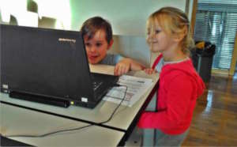
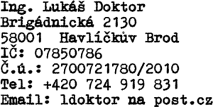

# Programování pro děti

tato stránka obsahuje základní informace o kurzu **Programování pro
děti** pořádaném na **ZŠ Nuselská** a zároveň bude obsahovat
materiály použité v jednotlivých lekcích aby mohly sloužit studentům
jako připomínka, či jiným lektorům jako zdroj informací.

## Aktuality:

**Na rok 2021-2022 je vypsán nový kurz, dle zájmu 1-3 skupiny. Termíny
budou upřesněny v průběhu září, ale nejspíš opět čtvrtky po 14 hodině
v prostorách ZŠ Nuselská. Hlásit se mohou děti z jakýhkoliv škol, 1. - 4.
ročníky. V případě uzavírky bude výuka omezeně probíhat online
či v MammaCentru. Více info v [letáku](courses/2021_2022/letacek.jpg)**

## Současné kurzy:

* ZŠ Nuselská 2021/2022 - 1 - 3 skupiny po 6-8 žácích 1. až 4. tříd, pravděpodobně ve čtvrtek odpoledne [informační leták](courses/2021_2022/letacek.jpg)

## Archiv kurzů:

* ZŠ Nuselská 2020/2021 - ~~[začátečníci](courses/2020_2021/zacatecnici.md)~~, [pokročilí](courses/2020_2021/pokrocili.md) &nbsp;&nbsp; ([letáček](courses/2020_2021/letacek.jpg), [miniletáček](courses/2020_2021/miniletacek.pdf), [přihláška](courses/2020_2021/prihlaska.pdf))
* ZŠ Nuselská 2019/2020  - [začátečníci](courses/2019_2020/zacatecnici.md) &nbsp;&nbsp; ([letáček](courses/2019_2020/2019-nuselska.jpg), [přihláška](courses/2019_2020/2019-prihlaska.pdf))

## Lektoři

* [Lukáš Doktor](lectors/ldoktor.md)

## Další

* [Informace pro mladší/starší sourozence](additional.md)

## Kontakt

* * * * *

Rád bych poděkoval kolegovi Mirku Suchému, který podobné kurzy
organizuje řadu let [V Brně](https://krouzek-programovani.cz/),
a který mi poskytl cenné rady do začátku. Některé z nich
jsou volně k dispozici
[na jeho githubu](https://github.com/xsuchy/programovani_pro_deti).

 Toto dílo podléhá licenci [Uveďte původ-Zachovejte licenci 4.0 Mezinárodní](https://creativecommons.org/licenses/by-sa/4.0/).
